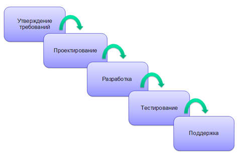

Так уж сложилось, что в мире IT не существует универсальной методологии разработки ПО. У каждой есть свои плюсы и минусы.

В этой статье пойдет речь о 4-х самых распространенных на мой взгляд методологий, с которыми я успел столкнуться как на работе, так и в своих проектах.

Итак, вот они ~~слева направо~~ сверху вниз:

1) Waterfall
2) Agile (Scrum)
3) Итеративная
4) Инкрементная

Пойдем по порядку:

#### 1) Waterfall

Waterfall называют еще "каскадной моделью" или "водопадом", и это неслучайно.

Основной принцип этой модели в том, что следующий этап разработки ПО не может быть начат, пока полностью не будет закончен предыдущий.

То есть, мы не можем начать проектирование пока не соберем и не утвердим все требования, разработку - пока полностью не спроектируем интерфейс и так далее.

Практика показывает, что методология отлично подходит для проектов гос. сектора, а также проектов, которые не заточены под быстро меняющиеся технологии и тренды.

Из этого вытекают очевидные плюсы и минусы методологии:

##### Плюсы

* Легко оцениваемые сроки и бюджет проекта.

* Прозрачность и ясность состояния проекта на каждом его этапе.

##### Минусы

* Отсутствие гибкости (нет возможности вернуться на предыдущий этап).

* Высокая стоимость внесения изменений.

#### 2) Agile (Scrum)

Гибкая методология разработки ПО, представляющая собой манифест из 4 ценностей и 12 принципов. Основная идея Agile:

	Люди и взаимодействие важнее процессов и инструментов

Одним из вариантов использования Agile на практике является **Scrum**.

В Scrum существуют спринты - план работ и задач на выбранный интервал времени, они обычно длятся от 1 до 4 недель. 

По структуре спринта можно выделить следующую последовательность:

1) Изначально Product Owner (владелец продукта) формирует общий бэклог на проект. Как правило, это верхнеуровневые задачи по типу "Сделать авторизацию" или "Добавить сервис оплаты"

2) После чего команда устраивает планирование спринта. На планировании обсуждаются цели и задачи спринта, длительность спринта, назначаются роли участников, а также формируется бэклог на спринт.

3) После чего начинается сам спринт, который длится согласованное на предыдущем шаге время. Во время спринта также проводятся **Daily** - ежедневные встречи с командой, на которых каждый участник рассказывает о том, что он успел сделать с момента последнего Daily, что ему предстоит сделать до следующего Daily, а также трудности, которые возникли в ходе работы.

4) После окончания спринта проводятся Ретроспектива и Sprint review. Первое нацелено собрать обратную связь от участников спринта об их моральном состоянии, что понравилось и не понравилось в организации прошедшего спринта. Второе - оценить результативность и сопоставить план/факт по задачам на спринт.

Плюсы и минусы подхода Scrum:

##### Плюсы

* Легко подстроиться под потребности и хотелки заказчика.

* В случае неудачи или несоответствия продукта ожиданиям, стоимость изменений будет значительно ниже, чем при каскадной методологии.

##### Минусы

* Неопределенные сроки и бюджет. 

* Недостаточная документация проекта.

#### 3) Итеративная

Итеративная модель жизненного цикла не требует для начала полной спецификации требований. Создание продукта начинается с реализации части функционала, становящейся базой для определения дальнейших требований.

##### Плюсы

* Быстрый старт. Необязательно иметь полную спецификацию чтобы приступить к разработке, достаточно четкого конечного видения продукта.

* Легкая адаптация к новым требованиям и изменениям.

##### Минусы

* Большие затраты ресурсов. Если итераций много, реализация может потребовать много усилий и ресурсов.

#### 4) Инкрементная

Инкрементная методология получается, если разбить [Waterfall](#1-waterfall) на несколько различных модулей (на несколько меньших каскадов). Каждый модуль проходит через этапы, описанные в методологии Waterfall. 

Процедура разработки по инкрементной модели предполагает выпуск продукта в базовой функциональности (MVP), а затем уже последовательно, готовыми модулями (инкрементами), добавлять новые функции. Процесс будет продолжать до тех пор, пока не будет создана полная система.

Инкрементная методология идеально подходит для стартапов или MVP решений, которые нужно быстро вывести на рынок и собрать обратную связь для дальнейшего улучшения продукта.

##### Плюсы

* Быстрый старт. Можно выпустить базовый функционал в MVP как основной модуль, после чего уже доделывать остальные.

* Адаптация к новым требованиям и изменениям.

##### Минусы

* Как и в Waterfall, для старта необходимо иметь полную спецификацию требований отдельно для каждого модуля.

* Отсутствие гибкости (нет возможности вернуться на предыдущий этап).

Напоследок, хотелось бы наглядно показать различие инкрементной и итеративной методологий разработки:

Как видно на изображении, при итеративной методологии картина создается сначала наброском, затем прорисовкой и уже потом появляется готовая версия.

В случае инкрементной модели сначала появляется первая половина картины, но сразу целиком, а уже затем присоединяются оставшиеся 2 части.

Источник: https://habr.com/ru/companies/edison/articles/269789/
