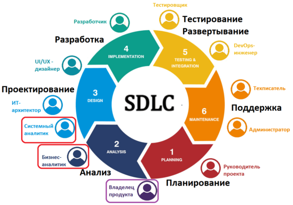

Существует модель **SDLC** (software development life-cycle), которая содержит этапы создания любого IT-продукта. 

В модель входят 6 основных этапов:

1) Планирование и сбор требований
2) Анализ и согласование требований
3) Проектирование архитектуры и дизайна
4) Разработка продукта
5) Тестирование продукта
6) Внедрение и сопровождение продукта

Рассмотрим каждый из этапов более подробно на примере web-приложения по учету финансов.

#### 1) Планирование и сбор требований

На этом этапе у заказчика появляется идея о создании некого продукта, который бы помогал отслеживать ему собственные траты для отслеживания и учета своих финансов. У заказчика появляется первое представление о том, как должен выглядеть готовый продукт (дизайн и функциональность). Далее заказчик идет к команде разработки (назовем ее "Рога и копыта"), которые будут готовы взять за работу и сделать web-приложение по требованиям. 

#### 2) Анализ и согласование требований

Действия начинаются, когда заказчик приносит команде свои требования и просит сделать "что-то похожее". Аналитики из "Рога и копыта" внимательно изучают требования, задают уточняющие вопросы при необходимости и, наконец, согласовывают требования с заказчиком. На данном этапе мы получаем **SRS** - (Software Requirements Specification), или по простому - итоговый документ с требованиями. Он включает в себя функциональные требования, нефункциональные требования, описание работы и возможностей системы (может быть в виде Use Case), а также ограничения и внешние интерфейсы.

#### 3) Проектирование архитектуры и дизайна

Когда у "Рога и копыта" имеются полные непротиворечивые и согласованные требования, они начинают проектирование архитектуры и дизайна. Системные аналитики с архитекторами занимаются проектированием серверной части web-приложения (базы данных, выбор языков программирования и фреймворков, проектирование и документирование API), а дизайнеры создают вайрфреймы и продумывают user flow, чтобы заказчику было интуитивно понятно пользоваться приложением. На данном этапе может быть показ спроектированного решения дизайна заказчику для согласования и утверждения, если команда разработки используют гибкую методологию разработки (Agile, Scrum и др.)

#### 4) Разработка продукта

После проектирования "Рога и копыта" приступают к самому долгому этапу - разработке приложения. На этом этапе реализуется все, что было спроектировано и продумано на предыдущих этапах. Программный код разработчиков и эскизы дизайнеров превращаются в готовый продукт, который будет приносить пользу заказчику.

#### 5) Тестирование продукта

После того, как разработчики закончили и приложение (а точнее прототип приложения) готов, в бой вступают тестировщики. Их задача найти и устранить максимальное количество багов и ошибок, которые не были учтены командой разработки до того момента, пока готовое приложение не отдали заказчику. 

#### 6) Внедрение и сопровождение продукта

После того, как все будет готово и протестировано, приложение разворачивается на стенде заказчика/заказчику дают доступ к приложению.
Заказчик начинает пользоваться приложением. На этом этапе осуществляется мониторинг и анализ ошибок, багов, нештатной работы приложения уже после развертывания. Также собирается обратная связь от пользователей, которая позволяет своевременно устранить ошибки и уязвимости приложения.

Примерно по такому принципу разрабатывается любое ПО. SDLC помогает структурировать и систематизировать этапы разработки ПО, что, в свою очередь, помогает в конечном итоге получить качественный продукт, отвечающий всем требованиям интересующих сторон.
